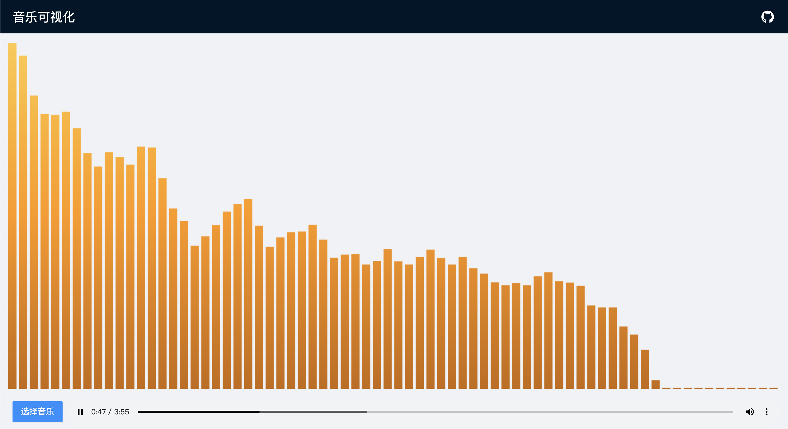

# Music Visualization

A simple tool for music visualization, utilizing HTML5 Canvas, written in TypeScript.

[中文报告](./docs/report.md) | [线上 Demo](https://music-visualization-hakula.vercel.app)

## Table of Contents

- [Music Visualization](#music-visualization)
  - [Table of Contents](#table-of-contents)
  - [Getting Started](#getting-started)
    - [Installation](#installation)
    - [Development](#development)
    - [Usage](#usage)
  - [Contributors](#contributors)
  - [License](#license)

## Getting Started

### Installation

Execute `./scripts/prebuild.sh` to install all prerequisites, and execute `./scripts/build.sh` to build the project in production mode.

### Development

Execute `yarn dev` to start a development server. Modifying your code will automatically trigger rebuild and hot reload in your page.

### Usage

Execute `./scripts/start.sh` to start the server. The website will be hosted on `localhost:7070` by default.

Execute `./scripts/stop.sh` to stop the server.

## Contributors

- [**Hakula Chen**](https://github.com/hakula139)<[i@hakula.xyz](mailto:i@hakula.xyz)> - Fudan University

## License

This repository is licensed under the MIT License - see the [LICENSE](./LICENSE) file for details.
